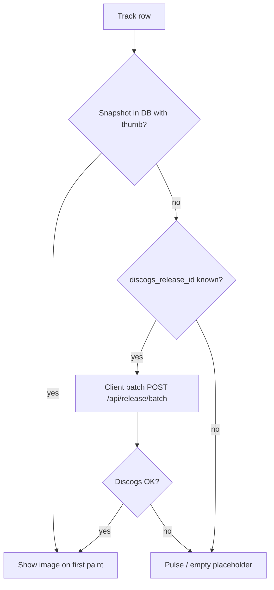

## Mental model (per track row)

```mermaid
flowchart TD
  A[Track row] --> B{Snapshot in DB with thumb?}
  B -->|yes| C[Show image on first paint]
  B -->|no| D{discogs_release_id known?}
  D -->|yes| E[Client batch POST /api/release/batch]
  E --> F{Discogs OK?}
  F -->|yes| C
  F -->|no| G[Pulse / empty placeholder]
  D -->|no| G
```

